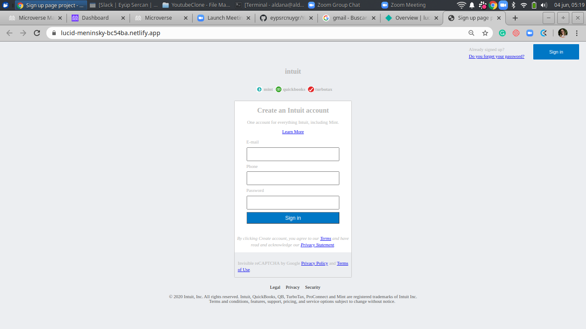

# Project Name

> This project consists of building an HTML document that matches the appearance of mint.com’s signup page

The point is to make it look like the real page as much as you reasonably can.

## Built With

- HTML
- CSS
- Netlify

## Live Demo

[Live Demo Link](https://lucid-meninsky-bc54ba.netlify.app/)

## Getting Started

**To see the site use the Netlify Link above**

To get a local copy up and running follow these simple example steps.

### Prerequisites

### Setup

### Install

### Usage

### Run tests

### Deployment

## Authors

👤 **Author1**

- Github: [@githubhandle](https://github.com/AlduLonghi)
- Twitter: [@twitterhandle](https://twitter.com/AbrilLonghi )
- Linkedin: [linkedin](https://www.linkedin.com/in/aldana-abril-longhi-a842ba1a7/ )

👤 **Author2**

- Github: [@githubhandle](https://github.com/eypsrcnuygr)
- Twitter: [@twitterhandle](https://twitter.com/eypsrcnuygr)
- Linkedin: [linkedin](https://www.linkedin.com/in/ey%C3%BCp-sercan-uygur-a55989a1/)

## 🤝 Contributing

Contributions, issues and feature requests are welcome!

Feel free to check the [issues page](issues/).

## Show your support

Give a ⭐️ if you like this project!

## Acknowledgments

- Hat tip to anyone whose code was used
- Inspiration
- etc

## 📝 License

This project is [MIT](lic.url) licensed.
